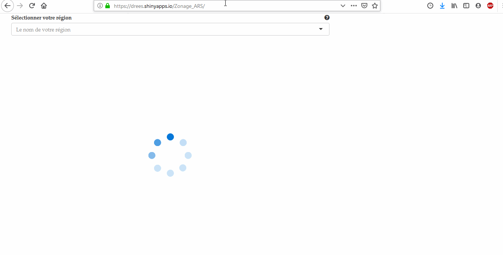
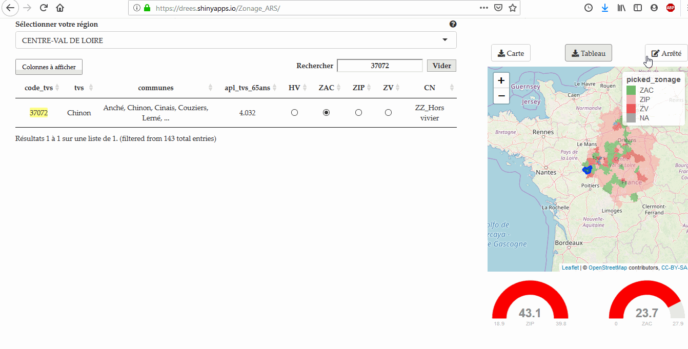

# Zonage médical des territoires de vie-santé

[https://drees.shinyapps.io/Zonage_ARS/](https://drees.shinyapps.io/Zonage_ARS/)

## Contexte

Cet outil développé avec R Shiny devrait permettre d'uniformiser la saisie du zonage médical et paramédical (sages-femmes & infirmiers) des territoires de vie-santé (TVS) et des Bassins de Vie Canton Ville (BVCV) par les Agences Régionales de Santé (ARS).

En plus de la vocation d'uniformisation, cet outil se veut ergonomique avec une interaction entre le tableau de saisie et une carte ainsi que la possibilité de rappeler à l'usager que certains TVS/BVCV ne devraient pas être édités par la région si le TVS/BVCV dépend d'une autre région (population de la zone principalement située dans l'autre région).

### Premier aperçu de l'application à l'ouverture 

- Choisissez votre région à l'aide du menu déroulant.
- Choisissez la profession dont vous souhaitez modifier le zonage : médecins généralistes, infirmiers ou sage-femmes.
- Si un TVS/BVCV est en sélection nationale ou qu'il ne dépend pas de la région, un sigle "interdiction" apparaîtra. Pour le faire disparaître, cliquer ailleurs sur la ligne et sélectionner "forcer l'édition".
- Pour sélectionner un TVS à partir de la carte, cliquer dessus. Le filtre peut ensuite être supprimé en cliquant sur "Vider" au dessus du tableau à gauche de la barre de recherche.
- Les modifications sont enregistrées automatiquement à intervalles réguliers mais vous pouvez aussi utiliser le bouton "Sauvegarder" situé en bas à gauche du tableau.

### Pour récupérer le tableau des communes avec le zonage choisi

Dans la dernière version de l'application, le fichier Excel contient la vision par TVS/BVCV et la vision par commune. En outre pour les médecins généralistes, un onglet contient le zonage des QPV.

Dans le tableau vous trouverez également des informations complémentaires sur la population de chaque zonage et l'APL de chaque zone.

### Pour récupérer la carte statique représentant ce zonage

Cette carte exportée en png peut être ajoutée en dernier annexe de l'arrêté.

### Pour récupérer une structure d'arrêté à éditer

En cliquant sur "générer l'arrêté", un formulaire s'ouvre afin de vous permettre de saisir toutes les informations spécifiques de votre arrêté.

Avant de télécharger le modèle d'arrêté vous avez la possibilité de choisir d'exporter ou non les tableaux et la carte. Sachez que les tableaux sont longs à générés, il est souvent plus rapide de récupérer les tableaux seuls et de les ajouter d'Excel vers Word par vous-mêmes.

## Pour rapporter des erreurs, bugs, suggestions d'améliorations

Remplir un [issue](https://github.com/phileas-condemine/Zonage_ARS/issues/new) sur Github ou un [issue](https://gitlab.com/DREES_code/OSAM/bps/formulaire_zonage_ars/-/issues/new?issue%5Bassignee_id%5D=&issue%5Bmilestone_id%5D=) sur Gitlab.

Si vous n'avez pas de compte Github ou Gitlab, un formulaire est également disponible dans le menu latéral gauche de l'application.

## Références

Cette documentation n'aurait pas été possible sans l'outil formidable ScreenToGif https://www.screentogif.com/

La persistance des données s'appuie sur dropbox.com ~~et Google Sheets~~.

L'application est hébergée grâce au service shinyapps.io

De nombreux packages R ont été nécessaires à ce développement : 

- shiny
- data.table
- DT
- leaflet
- ggplot2
- ggrepel
- sp
- sf
- shinyalert
- dplyr
- readxl
- flexdashboard
- jsonlite
- curl
- colourvalues
- bsplus
- rdrop2
- rgdal
- rgeos
- htmlwidgets
- lubridate
- openxlsx
- knitr
- kableExtra
- flextable
- ggsn
- shinydashboard
- shinyWidgets
- plotly
- slackr
- shinyjs

